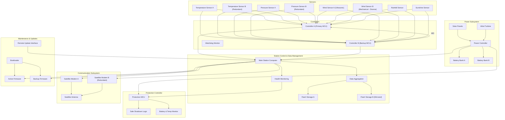

# Software Engineering II
Activities for Software Engineering II at Birkbeck University of London

```mermaid
flowchart TD

    %% =========================
    %% SENSORS
    %% =========================
    subgraph Sensors
        T1["Temperature Sensor A"]
        T2["Temperature Sensor B (Redundant)"]
        P1["Pressure Sensor A"]
        P2["Pressure Sensor B (Redundant)"]
        W1["Wind Sensor A (Ultrasonic)"]
        W2["Wind Sensor B (Mechanical - Diverse)"]
        R1["Rainfall Sensor"]
        S1["Sunshine Sensor"]
    end

    %% =========================
    %% SENSOR CONTROLLERS
    %% =========================
    subgraph Controllers
        CA["Controller A (Primary MCU)"]
        CB["Controller B (Backup MCU)"]
        WD["Watchdog Monitor"]
    end

    %% =========================
    %% MAIN CONTROL
    %% =========================
    subgraph StationControl["Station Control & Data Management"]
        CPU["Main Station Computer"]
        AGG["Data Aggregation"]
        STORE1["Flash Storage A"]
        STORE2["Flash Storage B (Mirrored)"]
        HEALTH["Health Monitoring"]
    end

    %% =========================
    %% PROTECTION SYSTEM
    %% =========================
    subgraph Protection["Protection Controller"]
        PCU["Protection MCU"]
        SAFE["Safe Shutdown Logic"]
        BAT["Battery & Temp Monitor"]
    end

    %% =========================
    %% COMMUNICATION
    %% =========================
    subgraph Comms["Communication Subsystem"]
        SAT1["Satellite Modem A"]
        SAT2["Satellite Modem B (Redundant)"]
        ANT["Satellite Antenna"]
    end

    %% =========================
    %% POWER SYSTEM
    %% =========================
    subgraph Power["Power Subsystem"]
        SOLAR["Solar Panels"]
        WIND["Wind Turbine"]
        BATT1["Battery Bank A"]
        BATT2["Battery Bank B"]
        PCTRL["Power Controller"]
    end

    %% =========================
    %% MAINTENANCE
    %% =========================
    subgraph Maintenance["Maintenance & Updates"]
        FW1["Active Firmware"]
        FW2["Backup Firmware"]
        BOOT["Bootloader"]
        REMOTE["Remote Update Interface"]
    end

    %% Connections: Sensors → Controllers
    T1 --> CA
    T2 --> CA
    P1 --> CA
    P2 --> CA
    W1 --> CA
    W2 --> CA
    R1 --> CA
    S1 --> CA

    T1 --> CB
    T2 --> CB
    P1 --> CB
    P2 --> CB
    W1 --> CB
    W2 --> CB
    R1 --> CB
    S1 --> CB

    CA <-- WD --> CB

    %% Controllers → Main CPU
    CA --> CPU
    CB --> CPU

    %% Main CPU internal flows
    CPU --> AGG
    AGG --> STORE1
    AGG --> STORE2
    CPU --> HEALTH

    %% Protection system
    HEALTH --> PCU
    PCU --> SAFE
    PCU --> BAT

    %% Power subsystem
    SOLAR --> PCTRL
    WIND --> PCTRL
    PCTRL --> BATT1
    PCTRL --> BATT2
    PCTRL --> CPU
    PCTRL --> PCU

    %% Communication subsystem
    CPU --> SAT1
    CPU --> SAT2
    SAT1 --> ANT
    SAT2 --> ANT

    %% Maintenance subsystem
    REMOTE --> CPU
    CPU --> FW1
    CPU --> FW2
    BOOT --> FW1
    BOOT --> FW2
```
