## Developing Reliability and Availability Requirements.
  * Refamiliarise yourself with the Wilderness Weather Station and Patient Information System for Mental Health case studies from the Sommerville book. For both case studies:
    - Create a set of non-functional reliability requirements for the main system services.
    - Choose an appropriate metric with which to quantify each non-functional reliability requirement (e.g. AVAIL, POFOD, ROCOF). Justify your choice.
    - Based on your understanding of how the systems and their components will be used, suggest appropriate values for the reliability metrics.

## Redundancy and Diversity
  * Explain why the Wilderness Weather Station system is a mission critical system, rather than a business or safety critical system.
  * Sketch out a system architecture for the Wilderness Weather Station. Suggest where software and hardware redundancy and diversity might be incorporated to bolster reliability.

---

## Wilderness Weather Station (WWS)

This is a *mission critical system* because the data are collected by the company and provides this data to others but it is not involved in activities that can compromise the business nor working on personal data.

### Non-functional requirements

- Storage data up to 4 days
- Weather data acquisition: periodic readings from instruments (temp, pressure, wind, rainfall).
- Local processing/aggregation: compressing/aggregating data before transmission.
- Data transmission to data management system via satellite.
- Health monitoring: instruments, power, comms hardware fault reporting.
- Power management: charging batteries, shutting down generators in dangerous conditions.
- Power preservation up to 7 days and use different sources
- Remote maintenance/reconfiguration: software updates, switching to backup instruments.
- Hibernate the system when it is not transmitting or readings instruments

### Metrics

| Service | Non-functional reliability requirement | Metric | Justification | Suggested value |
| --- | --- | --- | --- | --- |
| Weather data acquisition | The station shall successfully acquire each scheduled sensor reading with very low probability of failure on demand. | **POFOD** | Readings are discrete “demands” (e.g. every minute); we care about failure per reading, not per hour. | POFOD ≤ 10^{-3} per reading (≤1 failed reading per 1000) |
| Local processing/aggregation | Aggregation shall complete without corrupting data or losing more than one aggregation cycle per day. | **ROCOF** | Continuous background processing; failures better expressed as failures per operating time. | ROCOF ≤ 0.01 failures/day |
| Data transmission | When a satellite link is available, the station shall successfully transmit the daily aggregated dataset. | **POFOD** | Transmission is an intermittent, high-value demand (daily upload). | POFOD ≤ 10^{-2} per daily upload |
| Health monitoring | Faults in instruments, power, or comms shall be detected and reported with high reliability. | **POFOD** | Each health check/report is a discrete demand; missing one can hide serious degradation. | POFOD ≤ 10^{-3} per health-report cycle |
| Power management | The power management subsystem shall avoid unsafe battery depletion or generator damage during operation. | **ROCOF** | Power control is continuous; we care about rate of dangerous failures over time. | ROCOF ≤ 10^{-4} per day |
| Remote maintenance/reconfiguration | Remote update or reconfiguration operations shall complete without leaving the station in an unusable state. | **POFOD** | Updates are rare but critical demands. | POFOD ≤ 10^{-3} per update operation |
| Overall station availability | The station shall be available to collect and buffer data even when the satellite link is temporarily unavailable. | **AVAIL** | Station is long-running, non-stop; availability over time is key. | AVAIL ≥ 99.5% over a year |

The Wilderness Weather Station (WWS) is part of a national weather information system. The system collects climate data from remote areas to support climate-change monitoring and weather forecasting. Its failure primarily affects the mission of long-term data collection and forecast accuracy.

- Mission impact
  * If stations fail, the company continuous climate records and reduce the accuracy of forecasts in remote regions.
  * This has an impact on scientific goals and data issues
- Not primarily safety
  * The station does not directly control life-sustaining equipment or immediate safety functions (unlike, say, an insulin pump or aircraft flight control).
  * Poorer forecasts can contribute to risk, but there are many other data sources and systems; a single station’s failure rarely causes immediate catastrophic harm.
- Not primarily business critical:
  * The system is government-operated for public and scientific purposes, not as the core revenue engine of a single company.
  * Economic consequences (e.g. less accurate forecasts for agriculture or transport) are real but indirect and distributed.

### Architecture

Based on the requirements for *reliability* and *availability*, core of the second session, the goal is to have a redundant system organization and control on the system. For this reason, there are redundant sensors, energy sources and transmission devices.

```mermaid
flowchart TD

    %% =========================
    %% SENSORS
    %% =========================
    subgraph Sensors
        T1["Temperature Sensor A"]
        T2["Temperature Sensor B (Redundant)"]
        P1["Pressure Sensor A"]
        P2["Pressure Sensor B (Redundant)"]
        W1["Wind Sensor A (Ultrasonic)"]
        W2["Wind Sensor B (Mechanical - Diverse)"]
        R1["Rainfall Sensor"]
        S1["Sunshine Sensor"]
    end

    %% =========================
    %% SENSOR CONTROLLERS
    %% =========================
    subgraph Controllers
        CA["Controller A (Primary MCU)"]
        CB["Controller B (Backup MCU)"]
        WD["Watchdog Monitor"]
    end

    %% =========================
    %% MAIN CONTROL
    %% =========================
    subgraph StationControl["Station Control & Data Management"]
        CPU["Main Station Computer"]
        AGG["Data Aggregation"]
        STORE1["Flash Storage A"]
        STORE2["Flash Storage B (Mirrored)"]
        HEALTH["Health Monitoring"]
    end

    %% =========================
    %% PROTECTION SYSTEM
    %% =========================
    subgraph Protection["Protection Controller"]
        PCU["Protection MCU"]
        SAFE["Safe Shutdown Logic"]
        BAT["Battery & Temp Monitor"]
    end

    %% =========================
    %% COMMUNICATION
    %% =========================
    subgraph Comms["Communication Subsystem"]
        SAT1["Satellite Modem A"]
        SAT2["Satellite Modem B (Redundant)"]
        ANT["Satellite Antenna"]
    end

    %% =========================
    %% POWER SYSTEM
    %% =========================
    subgraph Power["Power Subsystem"]
        SOLAR["Solar Panels"]
        WIND["Wind Turbine"]
        BATT1["Battery Bank A"]
        BATT2["Battery Bank B"]
        PCTRL["Power Controller"]
    end

    %% =========================
    %% MAINTENANCE
    %% =========================
    subgraph Maintenance["Maintenance & Updates"]
        FW1["Active Firmware"]
        FW2["Backup Firmware"]
        BOOT["Bootloader"]
        REMOTE["Remote Update Interface"]
    end

    %% Connections: Sensors → Controllers
    T1 --> CA
    T2 --> CA
    P1 --> CA
    P2 --> CA
    W1 --> CA
    W2 --> CA
    R1 --> CA
    S1 --> CA

    T1 --> CB
    T2 --> CB
    P1 --> CB
    P2 --> CB
    W1 --> CB
    W2 --> CB
    R1 --> CB
    S1 --> CB

    CA <-- WD --> CB

    %% Controllers → Main CPU
    CA --> CPU
    CB --> CPU

    %% Main CPU internal flows
    CPU --> AGG
    AGG --> STORE1
    AGG --> STORE2
    CPU --> HEALTH

    %% Protection system
    HEALTH --> PCU
    PCU --> SAFE
    PCU --> BAT

    %% Power subsystem
    SOLAR --> PCTRL
    WIND --> PCTRL
    PCTRL --> BATT1
    PCTRL --> BATT2
    PCTRL --> CPU
    PCTRL --> PCU

    %% Communication subsystem
    CPU --> SAT1
    CPU --> SAT2
    SAT1 --> ANT
    SAT2 --> ANT

    %% Maintenance subsystem
    REMOTE --> CPU
    CPU --> FW1
    CPU --> FW2
    BOOT --> FW1
    BOOT --> FW2

```

